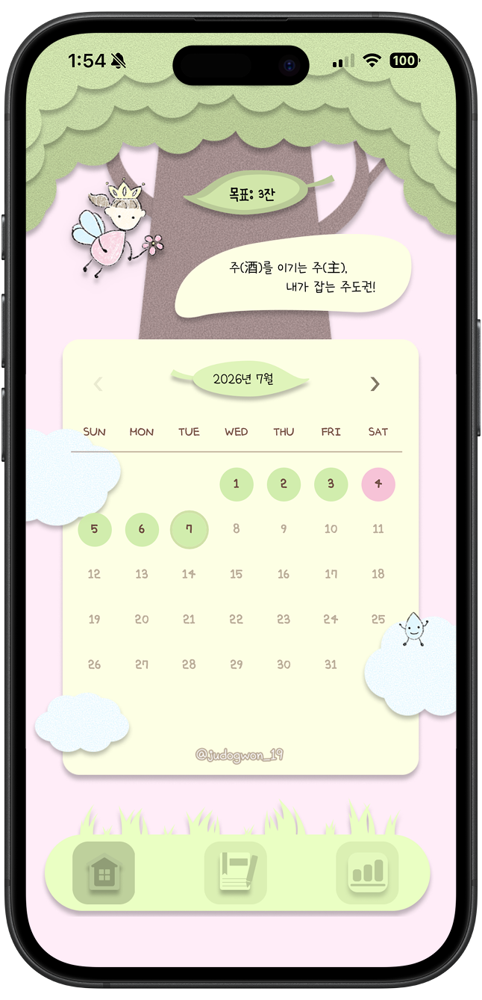
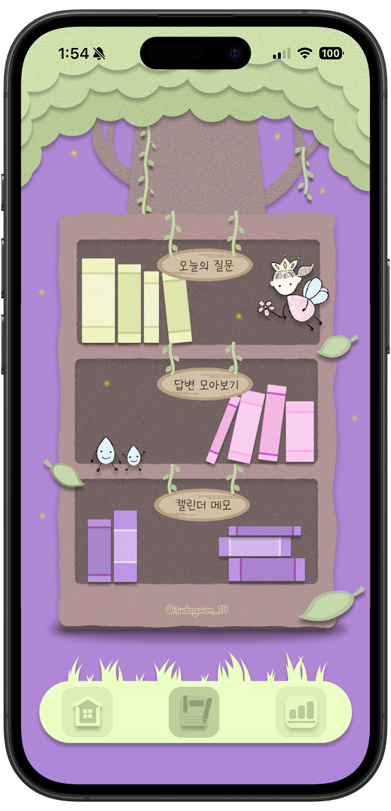
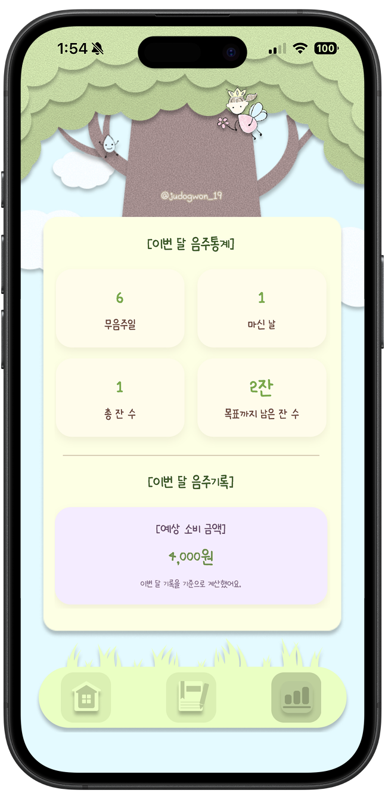

# 절주숲

## 소개

**절주숲**은 **[2026 대학생 절주 서포터즈] 주(酒)도권** 팀이 만든 프로젝트로, 음주폐해를 예방하고 건강한 절주 문화를 조성하기 위해 기획되었습니다.

방학이 되면 약속과 술자리가 자연스럽게 늘어나는 대학생들이 매일의 음주 여부를 기록하고, 스스로 세운 목표와 비교해보며 **"내가 술을 마시는 이유"를 되돌아보는 시간**을 가질 수 있도록 만들었습니다.

숲속 요정과 함께, 당신의 절주를 응원합니다!

## 화면 미리보기

  
  
  

## 주요 기능

### 홈 - 음주 캘린더

- 매일 **"마셨어요 / 안 마셨어요"** 를 기록하는 캘린더
- 마신 날은 주종(소주, 맥주, 와인, 막걸리, 하이볼, 칵테일, 기타)과 잔 수, 한 줄 메모까지 함께 기록
- 이번 달 **목표 잔 수**를 설정할 수 있으며, 신중한 목표 설정과 다짐을 위해 월 1회만 수정 가능

### 책장 - 나를 돌아보는 기록

- **오늘의 질문**: 매일 하나씩 등장하는 절주와 건강 관련 질문에 답변을 남기는 기능
- **답변 모아보기**: 지금까지 쌓인 답변을 날짜순으로 확인
- **캘린더 메모**: 캘린더에 남긴 메모만 모아서 다시 볼 수 있는 공간

### 통계 - 이번 달 음주 리포트

- 무음주일, 마신 날, 총 잔 수, 목표까지 남은 잔 수를 한눈에 확인
- 이번 달 기록 기준 **예상 소비 금액**과 **음주 예상 칼로리** 자동 계산
- 목표보다 덜 마셨을 경우, **아낀 금액과 줄인 칼로리**를 보여주며 긍정적 동기부여
- 질병관리청 국가건강정보포털과 보건복지부 절주 실천수칙을 참고한 **절주 건강 정보 카드** 제공

## 데이터 저장 안내

이 앱의 음주 기록, 목표 잔 수, 오늘의 질문 답변 데이터는 사용자의 브라우저 `localStorage`에 저장됩니다.

별도의 서버로 전송되거나 외부 데이터베이스에 저장되지 않습니다.

## 건강 정보 안내

앱 내 건강 정보는 질병관리청 국가건강정보포털과 보건복지부 절주 실천수칙을 참고한 절주 동기부여용 정보입니다.

개인의 건강 상태에 따라 차이가 있을 수 있으며, 의학적 진단이나 치료를 대신하지 않습니다.

## 팀 소개

**[2026 대학생 절주 서포터즈] - 주(酒)도권**

음주폐해 예방 및 절주 문화 조성을 선도하는 대학생 서포터즈 팀입니다.

인스타그램: [@judogwon_19](https://www.instagram.com/judogwon_19)

## 저작권 안내

© 2026 주(酒)도권. All Rights Reserved.

본 프로젝트는 **2026 대학생 절주 서포터즈 활동**을 위해 제작된 비상업적 프로젝트입니다.

프로젝트에 포함된 모든 소스코드, UI/UX 디자인, 화면 구성, PNG 이미지, 일러스트, 아이콘, 그래픽 및 문구의 저작권은 제작자에게 있습니다.

제작자의 사전 서면 동의 없이 프로젝트의 전부 또는 일부를 복제, 수정, 재배포하거나 다른 프로젝트에 사용하는 것을 금지합니다.

본 프로젝트를 기반으로 한 무단 복제 또는 재사용은 허용되지 않습니다.
